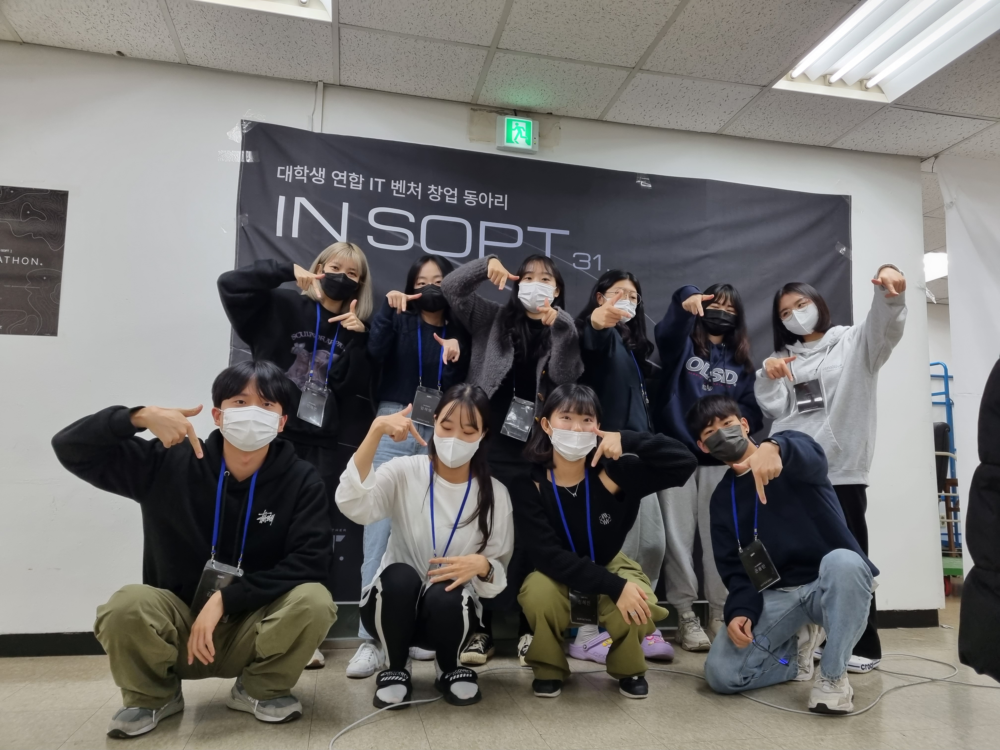
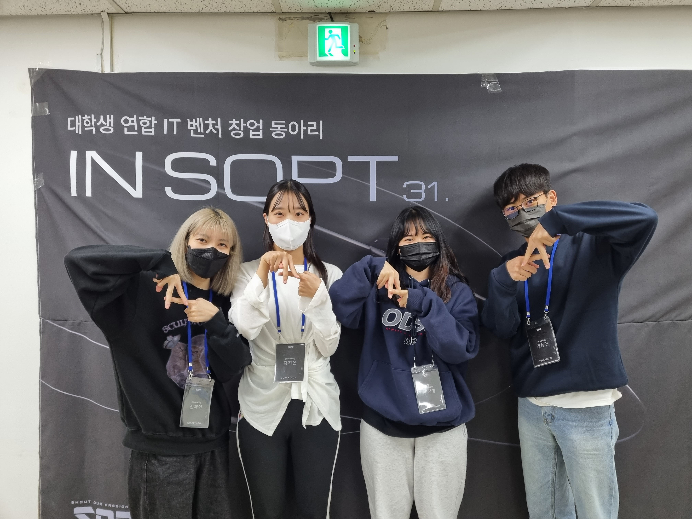

# 이름 도둑

## 서비스 소개
친구와 관련된 퀴즈를 푸며 닮은꼴로 이름 바꾸기(ex. 김동재 - 건강한 주우재)
 
 
 

## 사진

* __단체 사진__
  

 

* __파트 사진__
  
   
   
   

 
 
 

## 개발 역할 담당

|뷰| 이름 |
|---|----|
|홈| 지영 |
|프로필|용민|
|퀴즈|채연|
|다이얼로그|지은|

 
 
 

## 코딩 컨벤션

_ _ _

### 커밋 메시지  

태그 없이 자세하게  
_ _ _

### 브랜치 전략  

각자의 이름으로 브랜치 명을 정하고 해당 브랜치만을 사용해서 구현 후 main 브랜치에 머지한다.  
_ _ _

### 코딩 컨벤션

* .kt 파일은 CamelCase
* .xml 파일은 snake_case
* id 컨벤션 
  [view]_[description]  
  ex) tv_title

| 뷰                 |축약어|
|-------------------|---|
| TextView          |tv|
| EditText          |et|
| ImageView         |iv|
| Button            |btn|
| RecyclerView      |rv|
| ScrollView        |sv|
| ViewPager         |vp|
| FragmentContainer |fc|
| CardView          |cv|
| View              |view|
| constraintLayout  |layout|

